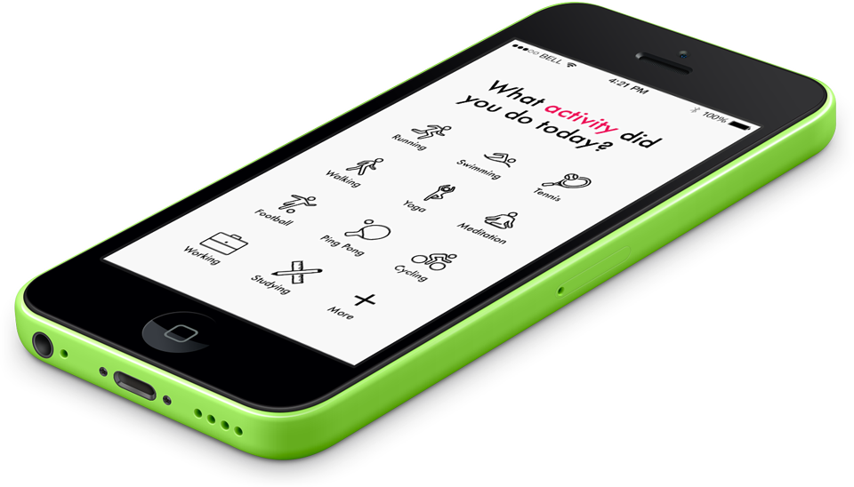
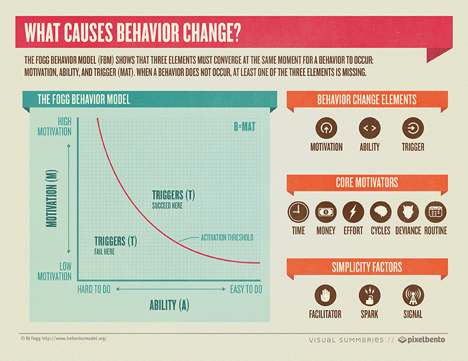
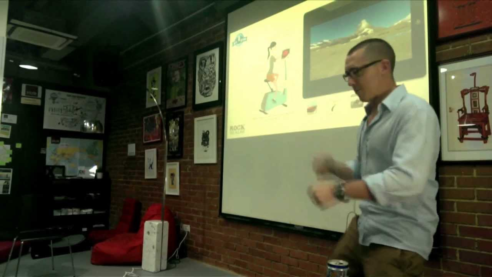
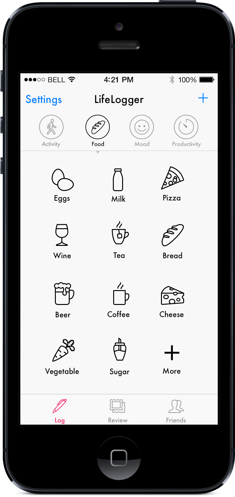
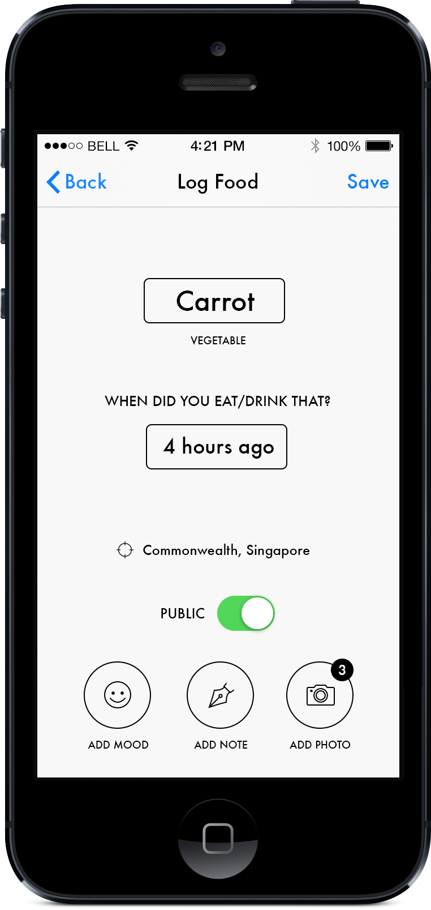
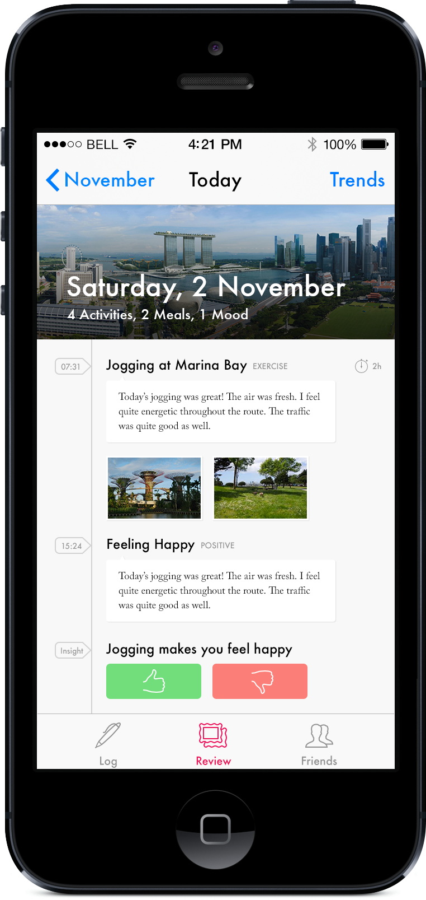
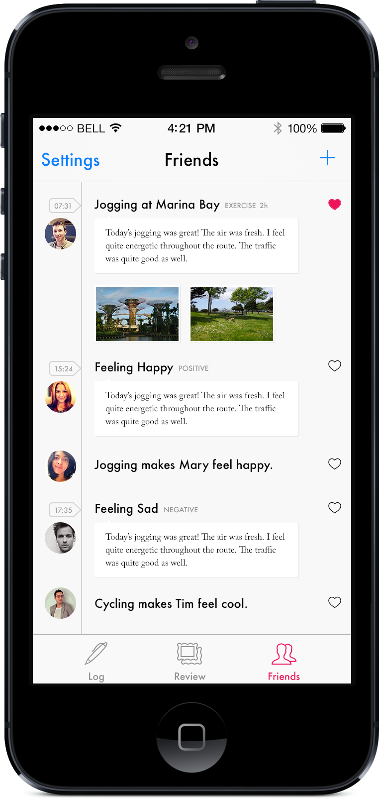

	

	LifeLogger is an iPhone activity tracker targeting the Quantified Self (QS) audience. 

___LifeLogger is my undergraduate dissertation project at the National University of Singapore. The iPhone app is designed and developed by myself in the span of two semesters.___

The Quantified Self movement is a fast growing trend in recent years. The aim of the Quantified Self movement is to incorporate technology into data acquisition on personal daily life including food consumption, mood states, mental and physical activities as well as performances. Although there are existing tracking devices and application in the market that aims to help people make better lifestyle choices and form healthier habits through activity tracking as well as self-reporting, most of the existing solutions fail to help user understand the underlying correlations of activities, mood states and performance. Lifelogger is an iPhone application that is designed to provide simple and straightforward lifestyle insights and health suggestions from self-reporting data through a mobile phone, which helps users better understand what they have logged as well as to inform the user ways to improve their lifestyles and habits.

### Background

Since the aim of the app is to help habit formation. It is important to understand how habits are formed. The Behavior Model developed by Dr. BJ Fogg (2009) at Stanford University shows that three necessary elements must converge at the same time for a behavior to occur: Motivation, Ability and Trigger. If one or more of the three elements is missing, a behavior does not occur. This model asserts that for a person to perform a target behavior, he or she must (1) be sufficiently motivated, (2) have the ability to perform the behavior, and (3) be triggered to perform the behavior. The Behavior Model is widely used in the design and analysis of persuasive technologies.

<figure>
	
	<figcaption>Fogg Behavior Model</figcaption>
</figure>

Motivation in the context of the Behavior Model consists of three core motivators, each with two opposing sides: (1) Pleasure / Pain (2) Hope / Fear (3) Social Acceptance / Rejection. When designing persuasive systems, it is necessary to consider all three core motivators to boost the level of motivation in the system.

The second element in the Behavior Model is Ability. In reality, increasing ability indicates making the behavior easier to do. Since persuasive design relies heavily on the power of simplicity, it is important to design the system simple enough that requires the least learning effort from users.

Trigger is the last element in the Behavior Model. The idea of a trigger is to tell the user that now is the time to perform a behavior. Triggers are often overlooked as a vital aspect of designing persuasive products. For situations where people are already have sufficient motivation and ability, a trigger is the final thing required for a behavior to occur. With interactive devices such as mobile phones and computers, triggers are particularly efficient since users can perform the target behavior immediately after receiving a trigger.

Besides the three elements stated in the Behavior Model, Fogg also suggests that persuasive technology should use seven strategies to influence behavior: reduction, tunneling, tailoring, suggestion, self-monitoring, surveillance, and conditioning (Zhuang, 2013).

* ___Reduction___ – simplifies a task that the user is trying to do.
* ___Tunneling___ – guides the user through a sequence of activities, step by step.
* ___Tailoring___ – provides custom information and feedback to the user based on their actions.
* ___Suggestion___ – gives suggestions to the user at the right moment and in the right context.
* ___Self-monitoring___ – enables the user to track his own behavior to change his behavior to
achieve a predetermined outcome.
* ___Surveillance___ – observes the user overtly in order to increase a target behavior.
* ___Conditioning___ – relies on providing reinforcement (or punishments) to the user in order to
increase a target behavior.

The Behavior Model developed by Fogg is very useful for designing persuasive systems, however, forming a habit requires repetition of a behavior until automaticity is reached. According to the experiment done by Phillippa Lally, et al. (2010), the time required for participant to achieve automaticity ranges from 18 to 254 days, showing considerable variation in time range for individuals to reach their limit of automaticity. In addition, the increase of automaticity follows an asymptotic curve with repetition of a behavior in a consistent context. The conclusion of the experiment indicated that systems designed for habit formation need to trigger the target behavior frequently during the initial period of the formation process. The frequency of the triggers can be reduced as user gains more automaticity during the process with the rate varied according to how fast or slow the user adopts to the target habit.

### Initial User Research

It is vital important to understand the target user group before designing the application. The primary intended users should be people who are interested in any form of Quantified Self activities/practices. It is particularly applicable and suitable for people who have been actively tracking their daily activities and are interested to gain more insights into how the data could help them live happier and make healthier choices in life. The primary user research is conducted at the Singapore Quantified Self meet up group, where informal interviews are conducted to collect user demographics as well as their needs, pain points and requirements.

<figure>
	
	<figcaption>Singapore QS Meetup</figcaption>
</figure>

After initial user research, the main pool of target users can be divided into two main groups: 

Group 1: College students/young adults

Group 2: Middle-aged working adults

In particular, the demographics of Singapore QS group can be described in the following points:

* Mostly working adults, a large percentage of people are foreigners.
* Both young and older people are present in the group.
* Meet up regularly to share their experience in tracking their lives.
* Willing to experiment, trying out new QS products and apps.
* Most of them have prior experience in various kind of activity tracking devices such as Fitbit, Jawbone Up etc.

### Personas Study

To better understand user requirements and facilitate the design process. User demographics and requirements are generalized into two specific personas:

Persona #1: ___Mary Smith___ (Fake name)

Mary Smith is a 22 years old college student. She is an active Fitbit activity tracker user. She cares a lot about her weight and wish to stay slim and attractive. She is graduating next year and is currently under stress to go through job applications and interviews.

The main pain points and needs that Mary Smith feels in her daily life include:

1. Often feels stressed due to her studies and job applications; wants to find a way to better managed her stress.
2. Wish to gain more insights in to her Fitbit activity data.
3. Wish to know under what circumstances does she fail to keep her diet under control. 
4. Want to get more support from friends to feel more motivated in his exercises and pursuit of healthy diet.

The corresponding potential solutions are:

1. The app is able to track the situations under which she stresses the most, and could help her prepare for future similar situations
2. Design a system that explains the correlation between activities, diets and mood states or productivity. The app could also provide suggestions on how to improve 
3. The app could show correlations between activities, emotion states and diets, thus let her know under what situation she is mostly likely to eat more. 
4. Add social elements to the app to facilitate social support

Persona #2: ___Robert Walton___ (Fake name)

Robert Walton is a 38 years old technical officer in a MNC. He is married with two kids. He is also an active member of the Singapore Quantified-Self group and attends QS meeting regularly. He uses Jawbone Up for activity tracking. In a normal work day, he usually spends long hours sitting at his desk.

Pain points and needs include:

1. Sometimes he finds it difficult to balance between work and life, need to find time to spend quality time with his children.
2. Wish to gain more insights into his Jawbone Up activity data
3. Wish to know how to get more energy to excel in his work

Potential solutions are:

1. The app could provide insight into the distribution of time into different activities in his daily life. He will know where his life is balanced or which part should be improved
2. The app could show correlations between the logged activity data and his emotion states.
3. The App could show what activity and diet could provide him with the most energy (reflected in emotion states) for his work.

Based on the personas study, the requirement for Lifelogger application can be summarized into the following features:

***Logging***

* User must be able to log daily activities.
* User must be able to log food intake.
* User must be able to log mood states.
* User must be able to log productivity.

***Review***

* User must be able to see the items logged during the day.
* App should display correlations between activities, food and mood states or productivity.
* User can set and track their health goals in the application

***Social***

* User can add friends in the application
* User can see friends logged items in the application and provide supports or comments

### Design Analysis

The design for LifeLogger should fit into BJ Fogg's behavior model:

* ___Reduction___ – The logging process should be as simple as possible. It should be designed to have the least effort in order to log any type of item into the system.
* ___Tunneling___ – The app should have a guided logging process that helps first time user log items fast.
* ___Tailoring___ – The app should try to use machine-learning techniques to learn user behavior and activities, thus providing useful feedbacks and suggestions for user to review.
* ___Suggestion___ – The app should be able to provide triggers, such as notifications and emails, to remind user to log or review regularly.
* ___Self-monitoring___ – The app should be able to track user defined goals. In addition, the app must also display user-logged items
* ___Surveillance___ – The app should keep record of all user-logged data and use the data to find patterns in user behavior. Persistence data requires a cloud service to sync data between the app and the server. 
* ___Conditioning___ – The implementation of social elements could help user reinforcement healthy life habits.

Based on previous user study and design analysis, LifeLogger should mainly include the following characteristics:

***Low effort logging***: to encourage user self-reporting, logging data should be as simple as possible. Thus the LifeLogger only get enough data to make accurate report of the person’s lifestyle and correlations between activities, diets and emotions. In the current design, calories or specific number of steps taken every day are not considered as core information. Thus, they are not required in the logging process.

***Easy customization***: user can customize the app in a way that all the frequent activities, diets or moods can be accessed easily.

***Clear and simple information for review***: Based on the activity logged in the app, certain habits will be inferred from machine learning techniques and the information will be displayed to user in a concise and clear way. Logged data is also contextualized in a timeline in terms of the time it is logged, location and its place relative to other things that happened in the day. 

***Insights***: From the correlations of activities, diets and emotions, users will be able to gain insight over time into certain behavior patterns which are positive or negative to their health. Examples of insights are sleeping earlier may make the user more productive; jogging in the morning regularly may make the user more positive in mood state, etc.

***Behavior changes/Trends***: Through the process of logging, reviewing and reflecting, the app encourages the user to change the negative habits in their daily life and provide triggers such as notifications for this change. The app will also show user the current trends in the logged data, such as how does productivity changed compared to previous month, etc.

***Social support***: Users can see how their friends are doing and feeling in the app. They can also provide and received social support at the same time.

### Interface Mockups

Only some of the interface mockups are shown here. If you would like to learn more about the app, please contact me for more information.

The logging screen are displayed with a collection of icons, which can be easily customized based on the preference of the user:

For logging, LifeLogger does not depend on calories data, but instead, it depends on item type and time to make predictions.

The review screen shows logged activities for today, as well as predicted trends and insights:

And finally, in friends tab, user can review public activities shared by other users he/she follows:

### User Testing

(In progress)

### Reflections
(In progress)

### References

Fogg. BJ. (2009). A Behavior Model for persuasive design. Persuasive ’09. April 26-29, Claremont, California, USA.

Kelly, K. (2007). What is the quantified self? Quantified Self Blog. Accessed 6 November, 13 from http://quantifiedself.com/2007/10/what-is-the-quantifiable-self/

Lally, P., Jaarsveld, C., Potts, H., and Wardle. J. (2010). How are habits formed: Modelling habit formation in the real world. European Journal of Social Psychology. 40, 998-1009.

Plutchik, R. (2001). The nature of emotions. Scienceweek. 3 August 2001.

Russel, J. and Barrett, L. F. (1999). Core Affect, Prototypical Emotional Episodes, and Other Things Called Emotion: Dissecting the Elephant. Journal of Personality of Social Psychology. Vol. 76. No. 5, 805¬–819.

Wolf, G. (2007). Quantified self. Aether. Access 6 November, 13 from http://aether.com/quantifiedself

Zhuang, D. (2013). Designing for behavioral change in health. UX Booth. Accessed 6 November, 13 from http://www.uxbooth.com/articles/designing-for-behavioral-change-in-health/